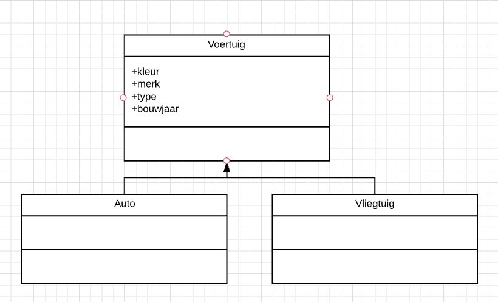

# OOP BASIC - Objecten en Properties

## taak04 - Zichtbaarheid

Bij de vorige taken hebben we het woord `public` gezet voor een property bij het maken van een Class.

```php
class Voertuig{
  public $model;
}
```

Dit woordje geeft aan waar de property te gebruiken is binnen de code. Het woordje __public__ geeft aan dat de property toegankelijk is vanuit de gehele code, vanuit alle andere Classes/Objecten. Het is geen kwestie van security maar meer van code structuren, dit wordt ook wel __DRY__ coderen genoemd. DRY staat voor Don't Repeat Yourself.

Er zijn nog twee andere woorden die je vaak zult tegenkomen:

- public
  - Toegankelijk vanuit de gehele applicatie
- protected
  - Alleen toegankelijk vanuit de eigen class of een child class
- private
  - Alleen toegankelijk vanuit de eigen class

Maar wacht eens even, wat is nu een `child class`?

Stel je hebt een Voertuig Class met bepaalde properties zoals type, merk en bouwjaar. Dan kun je van deze Class zogenaamde Child classes maken. Zoals een Vliegtuig Class of een Auto Class. Allebei voertuigen. De eigenschappen van de parent, de Voertuig Class, worden dan geerfd en hoef je niet opnieuw te maken (DRY == Don't Repeat Yourself).



De properties uit de Class Voertuig zijn bijna allemaal toegankelijk vanuit de Child Classes, er staat een `+` voor wat `public` betekent.

### voorbeeld

We gebruiken als voorbeeld de Voertuig Class. En we hebben een Vliegtuig class, dit is een Child class van voertuig

```php
class Voertuig{
    public $merk;
    public $type;
    public $bouwjaar;
    
}

//Voertuig is een Parent class van Vliegtuig. Je codeert dat zo:

class Vliegtuig extends Voertuig{
   public $lengteVleugel;
}

// we maken eerst een auto object

$auto = new Voertuig();
$auto->merk = "BMW";
$auto->type = "7 serie";
$auto->bouwjaar = 2015;

// we maken nu een vliegtuig object

$vliegtuig = new Vliegtuig();
$vliegtuig->merk = "Airbus";
$vliegtuig->type = "A350"
$vliegtuig->bouwjaar = 2013;
$vliegtuig->lengteVleugel = 64.75; //in meters
```

De properties van Voertuig kunnen door Vliegtuig gebruikt worden omdat Vliegtuig deze eigenschappen erft.
Zie je dat `$lengteVleugel` niet bij Voertuig staat en dus ook niet gebruikt kan worden. Het erven werkt natuurlijk maar 1 kant op.

Ok, dan weer even over die _zichtbaarheid_.

Stel nou dat we private gebruiken i.p.v. public bij `merk`. Dan is de eigenschap niet meer toegankelijk in de Child Class maar ook niet ergens anders in de code. Kijk eens hoe dat eruit ziet

```php
class Voertuig{
    private $merk; //we gebruiken nu private i.p.v. public
    public $type;
    public $bouwjaar;
}

$auto = new Voertuig();
$auto->type = "7 serie";
$auto->bouwjaar = 2015;
// Merk is niet meer toegankelijk van buiten de Class. Dus we kunnen de waarde ook niet veranderen :((

class Vliegtuig extends Voertuig{
   public $lengteVleugel;
}

$vliegtuig = new Vliegtuig();
$vliegtuig->type = "A350"
$vliegtuig->bouwjaar = 2013;
$vliegtuig->lengteVleugel = 64.75; //in meters

//het eigenschap merk is ook niet meer toegankelijk in Vlieguig
```

Oke, dus _private_ betekent dat je het eigenschap/property alleen kunt veranderen/inzien in de class zelf.

## Leerdoelen

1. [ ] Ik maak gebruik van de zichtbaarheid-woorden public, private en/of property

## Opdracht

1. Bekijk ook video [Class Diagram](https://www.youtube.com/watch?v=UI6lqHOVHic)
2. Maak gebruik van de `index.php` en de gegeven Classes.
3. Maak van alle classes een object en vul de properties met waardes (deze kun je zelf kiezen of opzoeken)

## Bronnen

- [Geek For Geeks - PHP | Classes](https://www.geeksforgeeks.org/php-classes/)
- [Geek For Geeks - PHP | Objects](https://www.geeksforgeeks.org/php-objects/)
